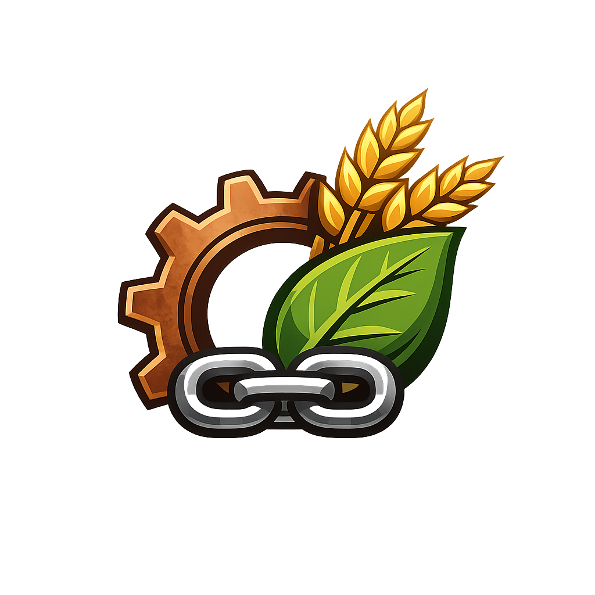

# Immersive BOP_Harvest

<p align="center">
  
</p>

- **Status:** alpha.9 release gate passes with the fresh Prism title-screen smoke explicitly waived by the owner
- **Target:** Minecraft 1.21.1, NeoForge
- **Mod ID:** `immersive_bop_harvest`
- **Current alpha:** `0.1.1-alpha.9`

## Purpose

A conservative compatibility addon connecting Biomes O' Plenty vegetation and wood to Farmer's Delight and Immersive Engineering.

The project deliberately avoids speculative or progression-breaking conversions. It adds:

- Farmer's Delight Cutting Board parity for BOP flowers;
- modest straw, stick, string and rotten-flesh processing;
- knife/sword harvest behavior for a narrow set of fibrous blocks;
- Farmer's Delight tree-bark stripping for BOP wood;
- Immersive Engineering Sawmill parity for 13 BOP wood families;
- common-tag compatibility for barley and toadstool.

It does **not** add new items, blocks, textures, magical drops, hemp from unrelated plants, free glowstone, mob drops from decorative blocks, or automation recipes.

## Package contents

- `00_START_HERE.txt` — handoff instructions
- `01_CODEX_MASTER_PROMPT.txt` — implementation prompt
- `docs/` — design, architecture, QA and release controls
- `spec/` — machine-readable source of truth
- `src/main/resources/` — generated playable-alpha data resources
- `src/main/templates/` — NeoForge metadata template
- `src/main/java/` — minimal NeoForge entrypoint
- `templates/` — neutral metadata templates
- `scripts/validate_specs.py` — specification validator
- `scripts/generate_alpha_resources.py` — source-to-resource generator
- `scripts/qa_alpha_resources.py` — generated-resource QA gate
- `scripts/sync_runtime_deps.ps1` — local runtime dependency sync from the configured Prism modpack
- `scripts/install_alpha_to_lab.ps1` — Windows Test play install and hash proof script
- `scripts/check_beta_release_gate.py` — public beta release gate checker with built/installed jar hash and duplicate install checks
- Gradle wrapper and NeoForge build files

## Build and validate

```powershell
python scripts/validate_specs.py
python scripts/generate_alpha_resources.py
python scripts/refresh_project_manifest.py
.\gradlew.bat --no-configuration-cache check
.\gradlew.bat --no-configuration-cache clean build
.\gradlew.bat --no-configuration-cache runGameTestServer
.\gradlew.bat --no-configuration-cache runData
powershell -NoProfile -ExecutionPolicy Bypass -File .\scripts\run_server_smoke.ps1
```

## Install to Prism Test play

The current private NeoForge 1.21.1 modpack target is:

```text
C:\Users\Emmanuel Tremblay\AppData\Roaming\PrismLauncher\instances\1.21.1 TesT play\minecraft\mods
```

Install and verify the project jar plus required runtime dependencies:

```powershell
powershell -NoProfile -ExecutionPolicy Bypass -File .\scripts\install_alpha_to_lab.ps1
```

The script writes `build/install-report.json` with source and installed SHA-256
values, metadata readback, dependency proof, and remaining-jar counts.

## Release gate

The project must pass every item in `docs/QA_ACCEPTANCE.md`.  
The owner selected `All Rights Reserved`; see `LICENSE`. Redistribution and
derivative use require prior written permission from the copyright holder.

Current alpha proof is recorded in `docs/PLAYABLE_ALPHA_PROOF.md`.
The current release audit is recorded in `docs/BETA_RELEASE_AUDIT.md`.
Legal provenance is recorded in `docs/LEGAL_REUSE_INVENTORY.md`.
Draft public notes are in `docs/BETA_RELEASE_NOTES_DRAFT.md`.

Run the release gate checker before any public beta upload:

```powershell
python scripts/check_beta_release_gate.py
```

Public binary release requires the checker to report `BETA RELEASE GATE: PASS`.

Current alpha.9 note: generated recipes, direct-harvest loot-table scoping,
common tags, manifest tests, clean build, installed-JAR readback, GameTests,
runData, license, packaged logo and dedicated-server smoke passed. The fresh
alpha.9 Prism title-screen smoke is `NOT_PERFORMED`: the owner explicitly
instructed Codex to skip this test phase. The release gate accepts only a
complete, explicit waiver record and does not report the skipped test as passed.

## Branding assets

The repository includes the owner-provided project logo plus the original
vector branding set and usage guide.

- official 1024 x 1024 PNG project logo;
- vector SVG logo;
- vector SVG banner;
- branding guide.

See `docs/BRANDING_GUIDE.md`.

## Publisher source automation (2026-09-05)

Generic fail-closed publisher code and regression tests are under `tools/release`.
See [publisher protocol](docs/CURSEFORGE_RELEASE.md) and
[dependency classification](docs/CURSEFORGE_DEPENDENCIES.md).
The manual publication workflow defaults to a secret-free dry run. Its presence
is not authorization to upload. Target publication remains
`BLOCKED_BY_MISSING_CURSEFORGE_PROJECT_CONFIGURATION`; the audited baseline has
no GitHub Release. No production upload, tag/release, or secret change occurred
in the source migration. Current version/license and historical owner-waived
client evidence are unchanged.
